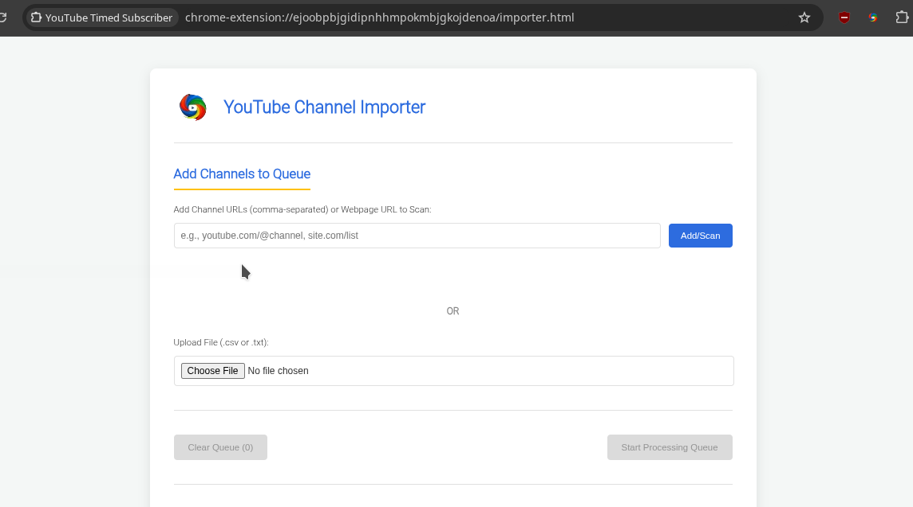

# Quicksub YT - Batch YouTube Channel Importer & Subscriber Assistant

<!-- Add other badges if you like: version, build status, etc. -->

**Efficiently import and process lists of YouTube channels for subscription. Stop subscribing one by one!**

Quicksub YT helps you manage large lists of YouTube channels by allowing you to import them from files (CSV, TXT), scan webpages for channel links, or add URLs directly. It then opens each channel page with a timed interval, giving you a window to manually subscribe, streamlining your workflow while respecting YouTube's guidelines.

**(Image: A GIF or a prominent screenshot of the extension's importer page in action would be great here!)**

## ✨ Features

*   **Multiple Input Methods:**
    *   **File Upload:** Import channel lists from `.csv` or `.txt` files.
        *   CSV: Flexible parsing (header optional, URL in 1st or 2nd column if no standard header).
        *   TXT: One valid YouTube channel URL per line.
    *   **Direct URL Input:** Paste one or more comma-separated YouTube channel URLs.
    *   **Webpage Scan:** Enter any webpage URL, and Quicksub YT will scan it to find and queue YouTube channel links.
*   **Timed Processing:** Opens each channel page sequentially with a 10-second window for you to manually click "Subscribe," followed by a brief pause before the next channel. This promotes safe and considerate usage.
*   **Generous Usage Limits (Currently all features are available for free!):**
    *   **Session Allowance:** Process up to **50** YouTube channels in a single session.
    *   **Session Reset:** If you don't use the extension for **1 hour**, your session allowance resets, giving you a fresh 50 channels.
    *   **Hard Cooldown:** After processing 50 channels in a session, a **1-hour** cooldown period is initiated before you can process more.
*   **Clear Queue Management:** Easily add URLs to a queue and clear it with a single click.
*   **User-Friendly Interface:** A dedicated importer page provides clear status updates and progress information.
*   **Cross-Platform (Planned):** Currently optimized for Chromium-based browsers, with Firefox support available via the Firefox Add-ons store.

## 🚀 Getting Started

### For Chromium-based Browsers (Chrome, Brave, Edge, Opera, Vivaldi) - From GitHub

Since the extension is not yet on the Chrome Web Store, you can load it manually from this GitHub repository:

1.  **Download the Extension:**
    *   Go to the [Releases page](https://github.com/snowballons/quicksub-yt/releases) of this repository.
    *   Download the `Source code (zip)` or `Source code (tar.gz)` file for the latest release.
    *   **Unzip the downloaded file** into a permanent folder on your computer (e.g., `Documents/Extensions/QuicksubYT`). Make sure you know where this folder is, as the browser will load the extension from there.

2.  **Load the Extension in Your Browser:**
    *   Open your Chromium-based browser (e.g., Chrome).
    *   Navigate to the Extensions page:
        *   Type `chrome://extensions` in the address bar and press Enter (for Chrome).
        *   Type `brave://extensions` for Brave, `edge://extensions` for Edge, etc.
    *   **Enable Developer Mode:** In the top right corner of the Extensions page, find the "Developer mode" toggle and switch it ON.
         <!-- You might want to host this image yourself or find a generic one -->
    *   **Load Unpacked:** Once Developer Mode is on, you'll see new buttons appear. Click on the "**Load unpacked**" button.
    *   **Select Folder:** A file dialog will open. Navigate to and select the folder where you unzipped the extension files (e.g., `Documents/Extensions/QuicksubYT` - select the main folder that contains `manifest.json`).
    *   The Quicksub YT extension should now appear on your Extensions page and its icon in your browser's toolbar!

    **(Video: A short screen recording GIF showing these steps would be incredibly helpful for users!)**

### For Firefox Users

Quicksub YT is available directly from the Firefox Add-ons store for easy installation:

*   **[ Firefox Add-on ](https://addons.mozilla.org/en-US/firefox/addon/youtube-timed-subscriber)**
    
    *   Simply click "Add to Firefox" on the store page.

## 📖 How to Use

1.  **Open the Importer:** Click the Quicksub YT icon in your browser toolbar. Then, click the "Open Channel Importer" button in the small popup. This will open the main importer page in a new tab.
2.  **Add Channels to Queue:**
    *   **File:** Click "Choose File" and select your `.csv` or `.txt` file containing channel URLs.
    *   **Direct Input:** Paste one or more comma-separated YouTube channel URLs into the text field and click "Add/Scan".
    *   **Webpage Scan:** Paste the URL of a webpage into the text field and click "Add/Scan". The extension will find YouTube channel links on that page.
3.  **Manage Queue:** The "Clear Queue (X)" button shows the number of unique URLs ready for processing. Click it to empty the queue.
4.  **Start Processing:** Once you have URLs in the queue and are ready (no active cooldowns), click "Start Processing Queue".
5.  **Manual Subscription:**
    *   The extension will open the first channel page in a new tab.
    *   The importer page will show a **10-second countdown**.
    *   During this time, switch to the new channel tab and **click the "Subscribe" button on YouTube yourself.**
    *   After the countdown and a short pause, the next channel will open, and the process repeats.
6.  **Monitor Status:** The importer page will display the current progress, session link usage (e.g., "7/50 links used this session"), and any cooldown information.

## ⚠️ Important Notes & Best Practices

*   **Be Respectful:** This tool is designed to assist your workflow, not to abuse YouTube's systems. Always subscribe manually during the provided window.
*   **Session Limits:** The extension has built-in session allowances (currently 50 channels) and cooldowns (1 hour) to encourage responsible usage.
*   **YouTube's Terms:** Ensure your use of this extension complies with YouTube's Terms of Service. We are not responsible for any actions taken against your YouTube account due to misuse.

## 🛠️ Development & Contribution (Optional Section)

*(If you want to encourage contributions or explain how to build/develop)*
This extension is built using HTML, CSS, and JavaScript (Manifest V3).
To set up for development:
1. Clone the repository: `git clone https://github.com/snowballons/quicksub-yt.git`
2. Load the extension as "unpacked" in your Chromium browser as described in the "Getting Started" section.

Contributions, bug reports, and feature requests are welcome! Please open an issue or a pull request.

## 📄 License

This project is licensed under the MIT License - see the [LICENSE.md](LICENSE.md) file for details.

---

